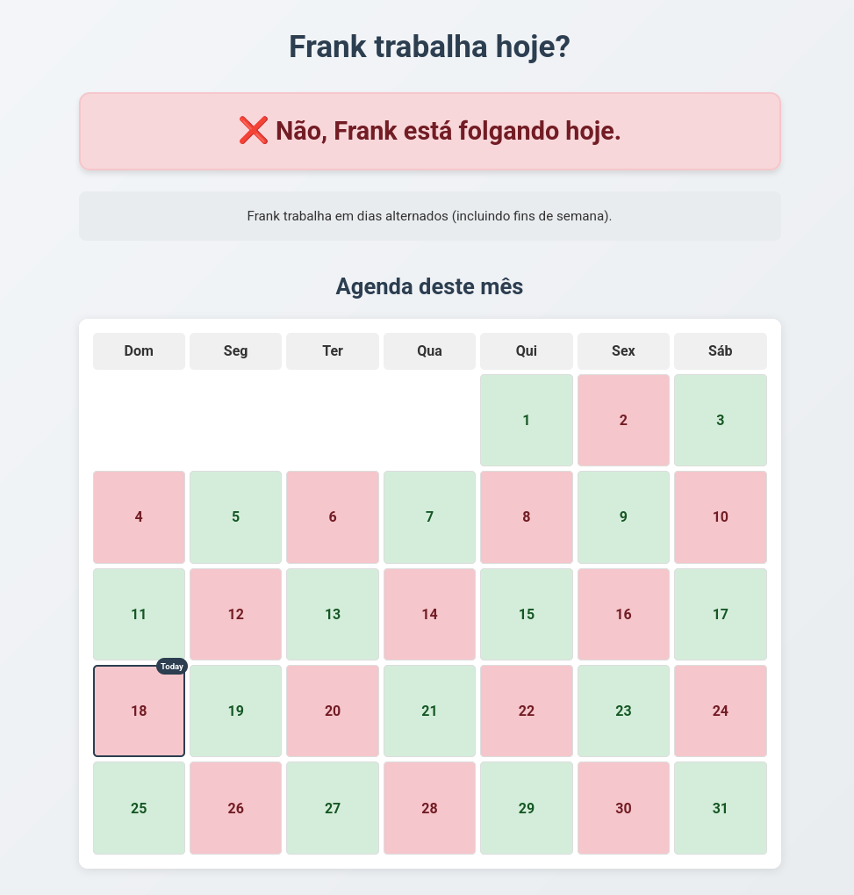

# Frank's Work Schedule Tracker 🇧🇷



A simple web app that predicts whether Frank is working today based on his alternating day schedule pattern.

## Features ✨

- ✅ Real-time "Working Today?" status indicator
- 📅 Current month calendar view
- 🔄 Infinite scroll future schedule (5+ years)
- 📱 Fully responsive design
- 🇧🇷 Portuguese (PT-BR) interface
- 📌 Persistent reference date (May 17, 2025)

## How It Works ⚙️

The app calculates Frank's schedule using:
1. Start date: May 17, 2025 (last worked date)
2. Pattern: Works every other day (including weekends)
3. Algorithm: `(days_since_start_date % 2 === 0)`

## Technologies Used 🛠️

- HTML5, CSS3, JavaScript (Vanilla JS)
- CSS Grid for calendar layout
- Responsive design with media queries
- Date-fns (optional future addition)

## Installation & Usage 🚀

1. Clone the repo:
   ```bash
   git clone https://github.com/self1027/frank-monitor.git
   ```
2. Open `index.html` in any modern browser
3. No server/dependencies required!

## Customization 🔧

To modify:
- Change `LAST_WORKED_DATE` in `script.js`
- Adjust `MONTHS_TO_LOAD` for performance
- Edit CSS variables in `style.css`


## License 📄

MIT License - Free for personal and commercial use
